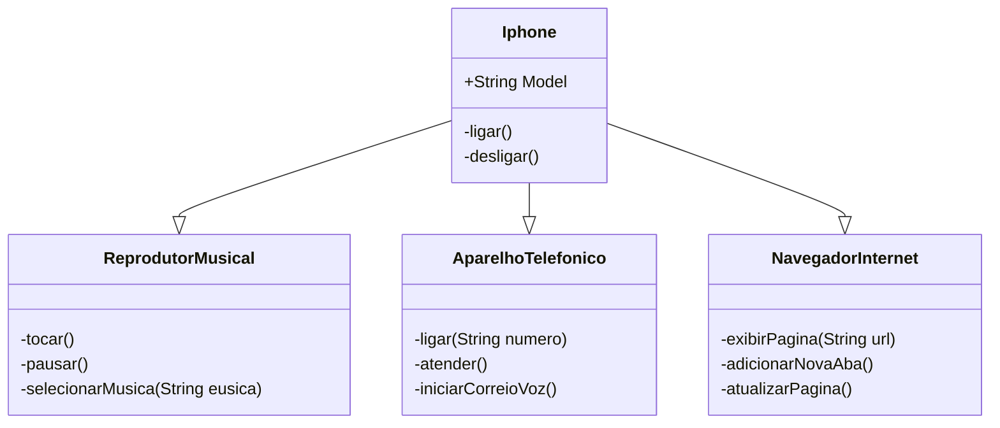

# Modelando o iPhone com UML: Funções de Músicas, Chamadas e Internet

## Autor 
George F. M. Silva 

### Diagrama

```mermaid
classDiagram
    Iphone : +String Model
    Iphone: -ligar()
    Iphone: -desligar()
    Iphone --|> ReprodutorMusical
    class ReprodutorMusical{
        -tocar()
        -pausar()
        -selecionarMusica(String eusica)
    }
    Iphone --|> AparelhoTelefonico
    class AparelhoTelefonico{
        -ligar(String numero)
        -atender()
        -iniciarCorreioVoz()
    }
    Iphone --|> NavegadorInternet
    class NavegadorInternet{
        -exibirPagina(String url)
        -adicionarNovaAba()
        -atualizarPagina()
    }

```

